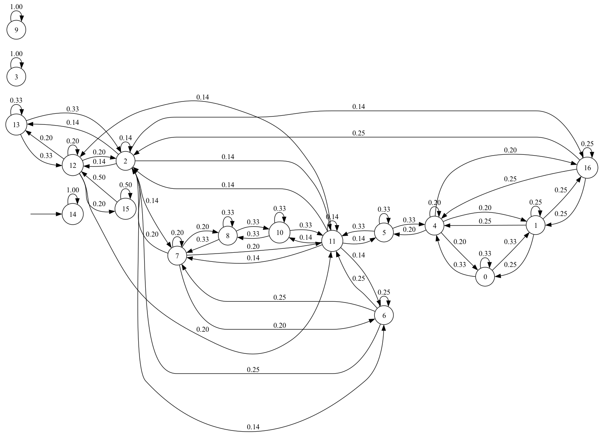

# Generador de Resúmenes para Noticias sobre Economía Usando Técnicas Basadas en Grafos

Por: Robin Quintero




## Requerimientos
Version de Python: 3.11

[Cómo crear un ambiente virtual?](https://docs.python.org/3/library/venv.html)

Instalar los requisitos:

```bash
pip install -r requirements.txt
```
